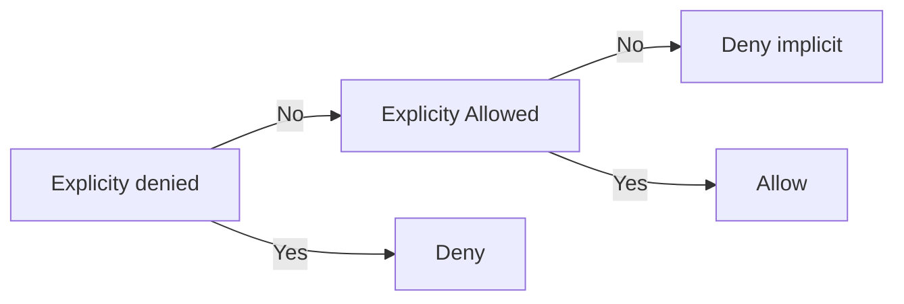

 ## Section 1 AWS shared responsibility model
Security and compliance responsibility is shared between AWS and the customer

AWS:
- Handles the software virtualization layer
- Handles protecting hardware, software, networking, and facilities

Customer:
- Encryption of the data at rest and transit
- Network configured for security 
- Security credentials and logins managed safely
- Configuration of security groups and operating systems that run on the compute instance
### AWS Security of the cloud
AWS responsibility for the physical infrastructure that hosts the resources
- Physical security of data centers
- Hardware infrastructure like servers etc. 
- Software infrastructure like hosts os etc.
- Network infrastructure like routers etc.

### Customer Security in the cloud
Customers responsible for what they put *in* the cloud. They are also responsible for what is implemented by using AWS services.
- Customers need to secure guest OS, apps, security groups, firewalls, etc.
- What content they choose to store on AWS
- Which AWS services store the content
- What country
- Format and structure of that content 
- Who has access to the content and how is the access managed

### Service Characteristics
Three types of services:
1. Infrastructure as a service (IaaS)
2. Platform as a service (PaaS)
3. Software as a service (SaaS)

IaaS:
Services that provide basic building blocks for cloud IT 
- Provides the customer with the highest level of flexibility and management control
- Customer responsible for managing more aspects of security
- Customer configures the access controls
>[!example]- Example IaaS 
>**Amazon EC2** can be a **IaaS**
>- Require customer to perform all necessary security configuration and management tasks
>- Responsible for managing gues OS

PaaS:
Services that remove the need for customers to manage underlying infrastructure
- AWS handles the OS, database patching, firewall, and disaster recovery
- Customer can focus on managing code and data
>[!example]- Example PaaS
>AWS Lambda and Amazon RDS
>- AWS operates the infrastructure layer, the os, and platforms.
>- Customer only need to access the endpoint to store and retrieve data

SaaS:
Services that provide software that is typically accessible via web browsers etc. or APIs 
- Licensing typically pay-as-you-go
- Customers do not need to manage infrastructure that support the service
- AWS manages all other aspects
>[!example]- Example of a SaaS
>Amazon Chime
>- A communications service that enables you to meet, chat etc
>- Pay-as-you-go communications service

## Section 2 AWS Identity and Access Management (IAM)
Free service that allows controlled user permissions for resources or services in AWS
- Control access services in AWS cloud
- Centrally manages resources in your AWS account
- Ability to specify exactly which **API** calls the user is authorized to make to each service
- Manage which resources can be accessed by who, and how these resources can be accessed
>[!note] What is a resource
>Entity in an AWS account that you can work with
>Example: An Amazon EC2 instance or an Amazon S3 bucket

### Essential Components
There are four IAM components:
1. IAM user
2. IAM group
3. IAM policy
4. IAM role

IAM user:
A **person** or **application** that can authenticate with an AWS account

IAM group:
A collection of IAM users have **identical authorization**
- No default group
- Groups cannot be nested

IAM policy:
Document that defines permissions of resource access and what they can be done with them

IAM role:
Tool for granting temporary access to specific AWS resources in an AWS account 
- Similar to IAM user
- Not uniquely associated with one person

>[!note]- Small note for IAM roles
>- Anybody can assume a role
>- Provides temporary security credentials for role session

#### Types Authentication as a IAM user
When defining an **IAM user**, you can select the **types of access** methods

Two types of access exist:
1. Programmatic Access
2. AWS management console access
Both can be assigned, one, or neither

Programmatic Access:
- IAM user to present **access key ID** and **secret access key**
- Provides CLI and SDK access

Management console access:
- Prompted to fill in either a **12-digit account ID** or **alias**
- Afterwards IAM **user name** and **password**
- If **multi-factor authentication** (MFA) is enabled present code 

##### MFA
Provides increased security
- Users and systems must provide an **MFA token**in addition to signing in

Generating token:
- Virtual MFA-compliant applications
- U2F security devices
- Hardware MFA devices

>[!example]- Some examples of generating tokens
>Virtual MFA-compliant applications:
>- Google Authenticator 
>- Authy2
>U2F security key devices:
>- Yubikey
>Hardware MFA options:
>- Key fob or display card offered by Gemalto

### Authorization
It is the process after authentication of determining what permissions a user, service, or application have.
- By default IAM users do not have any permission
- Must explicitly grant permissions by creating policies
>[!note] Quick note on policies *will be covered later*
>A document in JSON format 
>- Specifies permissions
- Best practice is to follow principle of least privilege 
>[!info]- What is "Principle of Least Privilege?"
>Stat with a minimum set of permissions a and then grant more as needed. 

>[!note]- IAM service configurations
>It is global and apply to all regions

### IAM policies
Formal state of permissions that is granted to an entity
- Can be attached to any IAM entity
- Most restrictive policy applies when there is conflict
- All policies all evaluated at once

Entities:
- Users, groups, roles, or resources

>[!note] What policies specify
>- The type of action allowed on a entity
>- Which resources to allow the actions on
>- What effect will be when user requests access to resoruce

The basic structure of the statements in an IAM Policy is:
- **Effect** says whether to _Allow_ or _Deny_ the permissions. 
- **Action** specifies the API calls that can be made against an AWS Service 
- **Resource** defines the scope of entities covered by the policy rule 

>[!example] An example policy
>
>Explicit denies in policies take precedence over allow statements

There are two types of IAM policies:
1. Identity-based policies 
2. Resource-based policies

<!-- Stopped here for flash cards -->
#### Identity-based policies
These are policies that you attach to a **user, group, roles.**
- Control what actions they can perform 

Two types of categorization:
- Managed policies
- Inline policies

Managed policies:
- Standalone identity-based policies that can attach to multiple user, group, role

Inline policies:
- Policies that are ONLY embedded into a  single user group or role

#### Resource-based policies
These policies are attached to a **resource**
- Specifies who has access to the resource
- What actions they can perform
- Inline only `defined on resource itself`
- Supported by some AWS services

>[!example]- Example of resource and identity policies
>
>Left side:
>Policy is attached to `MaryMajor` and allows access to S3 bucket
>Right side:
>Policy on the S3 bucket specifies that `MaryMajor` has access to the bucket

#### IAM Permission
IAM has a certain way to determine permissions.

## Section 3 Securing a new AWS account
The first AWS account created is a **root user** 
- Has complete access to all services and resources
- Accessed from Management console with email and password used to create it
- Can change support plant etc.

For the safety and security we should not use root often
- Create new IAM users and make policies
### Securing steps for new AWS accounts

#### Step 1: Stop using Root ASAP
To stop using root use these steps:
1. Create a IAM user for yourself with Management Console access enabled 
2. Delete root user access keys 
3. Create IAM group and attach policies that grant full access to a few services
4. Add user to group
5. Enable a password policy for users
6. Sign in to user
7. Store root credentials

#### Step 2: Enable MFA
This should be enabled for root and all other IAM user logins

#### Step 3: Use AWS CloudTrail
Cloud Trail is used to track user activity on your account
- Logs all API requests to resources
- Basic event history is enabled by default and is free
- Contains latest 90 days

To have longer access:
1. Create a trail from the Cloud Trail console page
2. Apply to all regions
3. Create a S3 bucket for log storage
4. Configure access restrictions to the bucket

#### Step 4 Billing report and Usage report
A additional step is to enable billing report and usage report
- Report updated at least once a day
- Estimated charges by hour or day

### Section 4 Securing Accounts
#### Organizations 
Enables you to consolidate multiple accounts to centrally manage them

Security Features
- Group accounts into organizational units (OUs) and attach different policies 
- Integrates with and supports IAM, a user can only access resources allowed by both policies
- Provide SCPs which can specify max permissions that accounts in an organization can have
- SCP only available when all features in organization is enabled
- SCP restrictions override admins of member accounts
#### Key Management Service (KMS)
Enables you to create and manage encryption keys and control the use of them
- Integrates with Cloud Trail to provide logs
- Can import your own key management infrastructure into KMS

Customer master key (CMKs):
- Has Customer Master Keys (CMK) to control access to data encryption keys that encrypt and decrypt data
#### Cognito
Provides solution to control access to AWS resource from application
- Adds user sign-in, sign-up, and access control to web and mobile application
- Huge scaling
- Support sign in through social identity providers like google etc. 
- Available globally on edge locations 
- Regional service 
#### Shield
It is a DDOS protection service 
- Always-on detection and automatic inline mitigations
- Standard is free, advanced is paid 
### Section 5 Securing data on AWS
#### Encryption at rest
Data at rest:
- Data stored physically 
- Can encrypt data stored in any service that is supported by KMS

>[!example] Examples of data that can be encrypted
>- S3
>- EBS
>- EFS
>- RDS 

#### Encryption in transit
Data in transit:
- Moving across network 
- Use Transport Layer Security (TLS)
- Certificate Manager provides a way to manage, deploy, and renew TLS cert 
- Data moving over HTTPS is secured using TLS or SSL
#### Securing S3 buckets and objects
New created buckets are private and protected by default 

To control access to buckets, we can use: 
- S3 block public access (Simple and easy)  
- IAM policies  
- Bucket policies (Used when user not login via IAM)  
- Access control lists (ACL) (legacy feature, older than policies) 
- Trusted Advisor (to do permission checking)
### Section 6 Working to ensure Compliance
#### Config
AWS config enables you to assess, audit, and evaluate configurations of resources
- Used for continuous monitoring 
- Automatically evaluate recorded vs desired 
- Review changes
- Detailed histories 
- Simplify compliance auditing and security analysis 
- Regional service 
#### Artifact 
Provides on demand downloads of AWS security and compliance documents
- Accessed directly through management console 
- Can use to review, accept and track status of AWS agreements
- You can accept an agreement on behalf of multiple accounts needs a OU 

