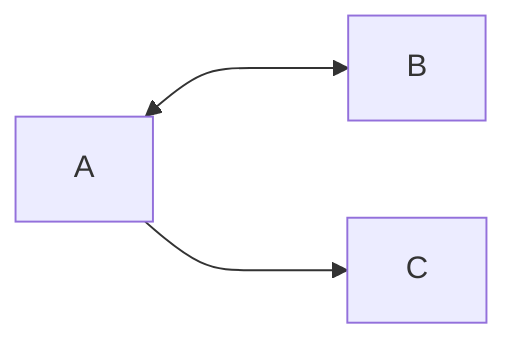

# Section 1 Networking basics
## Networks
A computer [[network]] is >= two machines connected to share information 
- Can be logically split into *subnets*
- Requires [[routers]] or [[Switches]] to connect clients together 

>[!NOTE]
> <h3>Simple network diagram</h3> 
> 

## IP addresses
Every client machine in a network has a unique IP to identify it
- Numerical label -> `192.0.2.0`
- Converted to binary -> `11000000. etc`
- Separated by `.`

IP Address:
- Every decimal is 8 bits -> `0 -> 255`
- Has 4 numbers in total -> `32 bits`
### IPv4 and IPv6
IPv6 helps have more users compared to IPv4 as there are more bits associated with it.

IPv4:
- A `32 bit` IP is called `IPv4` address 

IPv6:
- A `128 bit` IP is called `IPv6` address
- Eight groups of 4 hexadecimal numbers that are separated by a `:` 
- Can go from `0000` -> `FFFF` per group
## Classless Inter-Domain Routing (CIDR)
A common method to describe networks is CIDR
- An IP address
- Followed by a `/`
- Number of network bits

>[!NOTE]
> <h3>How a CIDR IP address looks like</h3>
>  
> <code>24</code> tells us the first 24 bits are fixed for the network portion  
> The last <code>32-24 = 8</code> bits are used to identify hosts 
> Means network can range from <code>192.0.2.0</code> -> <code>192.0.2.255</code> 
> When the host portion is all 1 -> <code>192.0.2.255</code> it means this is the broadcast address 
> When the host portion is all 0 -> <code>192.0.2.0</code> it means this is the network address 

Two special cases:
- A fixed IP address `192.0.2.0/32` which is used to set up a firewall rule and give access to a specific host
- The internet `0.0.0.0/0` which every bit is flexible

## Open Systems Interconnection (OSI) model
It explains how data travels over a network and consists of seven layers
- Shows common protocols and addresses used to send data to each layer
- Understand how communication takes place in a virtual private cloud (VPC) 

| Layer        | Number | Function                                                          | Protocol/Address       |
|:------------ |:------ |:----------------------------------------------------------------- | ---------------------- |
| Application  | 7      | How application will access network                               | HTTPS, FTP, DHCP, LDAP |
| Presentation | 6      | Application layer can read the data and encryption                | ASCI, ICA              |
| Session      | 5      | Enables orderly exchange of data                                  | NetBios, RPC           |
| Transport    | 4      | Protocols for host-to-host communications                         | TCP, UDP               |
| Network      | 3      | Routing and packet forwarding (routers)                           | IP                     |
| Data link    | 2      | Transfer data in the same LAN network (Hub/switches)              | MAC                    |
| Physical     | 1      | Transmission and reception of raw bitstreams over physical medium | Binary signal          |
# Section 2 Amazon VPC
A service that lets you **provision a logically isolated** part of AWS Cloud where you can launch AWS resources.

Gives control over virtual networking resources 
- Selection of own IP Address range
- Creation of subnets
- Configuration of route tables and network gateways
- Can use IPv4 or IPv6 
- Can customize the network configuration 
- Multiple layers of security 
## VPCs and Subnets
VPCs:
- Logically isolated from other VPCs 
- A VPC is dedicated to your account
- A VPC belongs to a single AWS Region and can span multiple Availability Zones

VPCs Subnets:
- Can divide a VPC into one or more subnets
- Subnets are a range of IP addresses in a VPC
- Subnets belong to a single availability zone 
- Subnets are classified as public or private 
- Public subnets has access to internet while private does not

>[!NOTE]
> <h3>Image showing a VPC in a region</h3>
> 

## IP Addressing
When creating a VPC can assign it either `IPv4` or `IPv6` CIDR block
- Cannot change address range after you create VPC 
- Largest `IPv4` CIDR block is `x.x.x.x/16`
- Smallest `IPv4` CIDR block is `x.x.x.x/28`
- CIDR blocks of subnets **cannot overlap**
### Reserved IP Addresses
A CIDR block requires you to reserve five IP addresses within the block
- Network address
- VPC local router (internal communications)
- Domain Name System (DNS) resolution
- Future use
- Network broadcast address

>[!IMPORTANT]
> <h3>Example of a VPC with 4 subnets</h3>
>  
> <code>10.0.0.0</code> -> Network Address 
> <code>10.0.0.1</code> -> Internal Communication 
> <code>10.0.0.2</code> -> DNS 
> <code>10.0.0.3</code> -> Future use 
> <code>10.0.0.255</code> -> Broadcast Address

### Public IP Address Types
When creating a VPC, every instance in it gets a private IP address automatically

Public `IPv4` Address:
- Manually assigned through Elastic IP address
- Automatically assigned through auto-assign public IP address settings at subnet level

Elastic IP address:
- Static and public `IPv4` address 
- Associated with an AWS account
- Can be allocated and remapped anytime incase of failure of an instance to another VPC instance 
- Additional costs might apply
### Elastic network interface
It is a virtual network interface that can attach or detach from an instance in a VPC 
- Networks interface attributes follow when its reattached
- When you move the interface from one instance to another, network traffic is redirected
- Each instance in your VPC has a default network interface that is assigned a private IPv4 address from the IPv4 address range of your VPC

>[!NOTE]
> <h3>More understanding</h3>
>- A secondary “port”, it can be attached to an instance (instance can have >2 IP addr to access it )  
>- Needs to have an IP address assigned to it  
>- Ensure redundancy as we can assign a elastic IP to it  
>- can attach/detach address to another instance if one fails (user can access another server if 1 fails), redirection of traffic  

### Routes Tables and Routes
Route tables contain a set of rules (routes) that directs network traffic from your subnet 
- Each **route** specifies a destination and target
- Destination is the VPC CIDR block
- Target is where it is send to
- Default every table contains a local route for communication within VPC
- Each subnet must be associated with at most one route table

Example of a route table:

| Destination | Target |
| ----------- | ------ |
| 10.0.0.0/16 | local  | 

# Section 3 VPC networking
## Internet gateway
It is a scalable, redundant and highly available VPC component
- Allows communication between instances in VPC and the internet 
- Perform NAT (network address translation) for instances with IPv4 

>[!NOTE]
> <h3>Example of an internet gateway</h3>
> 

## NAT gateway
It enables instances in a VPC private subnet to connect to internet or other services.
- One way connection only

Creating a NAT gateway:
- Specify a public subnet which it will be placed in
- Specify Elastic IP address to associate with it
- Update route table associated to private subnets to point traffic to it

>[!NOTE]
> <h3>Example of a NAT gateway setup</h3>
> 

## VPC sharing
This allows sharing of subnets with other accounts in the same organization using AWS Orgs.
- Host account makes a VPC and assign accounts in organization to a subnet

Benefits:
- Separation of duties
- Ownership
- Security groups 
- Efficiencies
- No hard limits
- Optimized costs

>[!NOTE]
> <h3>Example of a VPC sharing model</h3>
> 

## VPC peering
It is a networking connection between two VPCs for private communication
- Can be for own VPCs, another account, or different region

Setting up:
- Create rules in routable table for each VPC

Restrictions:
- IP address ranges cannot overlap
- Transitive peering is not supported
- Only one peering resource between two same VPCS
>[!TIP]
> <h3>Example of transitive peering</h3>
> - A communicates with B and vice versa.
> - A communicates with C
> - B communicates with C via A

>[!NOTE]
> <h3>Example of a VPC peering model</h3>
> 

## AWS Site-to-Site VPN
By default instances inside VPC cannot communicate with a remote network
- Slow data transfer rates
- Has encryption of network path
- Must state allow in security group for outbound traffic to data center

To connect VPC to remote network:
1. Create a new virtual gateway device (VPN gateway) and attach it to VPC
2. Define configuration of VPN device or customer gateway (a AWS resource that provides information to AWS about VPN device)
3. Create a custom route table to point corporate data center-bound traffic to VPN gateway. Must also update security group rules
4. Establish an AWS Site-to-Site VPN to link two system together
5. Configure routing to pass traffic through connection

>[!NOTE]
> <h3>Example of a Site-to-Site VPN</h3>
> 

## AWS Direct Connect
Used to have faster performance (over long distances)
- Dedicated and private connection between on-premise and AWS
- Replaces VPN for hybrid cloud infrastructure
- Does not encrypt network path by default 

>[!NOTE]
> <h3>Example of direct connect</h3>
> 

## VPC endpoints
A virtual device that enables private connection from VPC to supported services and VPC endpoint services that are powered by AWS PrivateLink
- Does not require much setup or require a public IP address to communicate
- Traffic does not leave the Amazon network

Two types of VPC endpoints:
1. Interface VPC endpoint
2. Gateway endpoints

Interface endpoint:
- Connect to services powered by PrivateLink
- Incurs additional charges

Gateway endpoint:
- No additional charge but only for S3 and Dynamo DB

>[!NOTE]
> <h3>Example of VPC endpoint model</h3>
> 

## AWS Transit Gateway
VPC Peering is point to point which causes connections to grow quickly
- A bit more difficult to scale
- Costly and difficult
- Cannot manage connectivity policies

Transit Gateway:
- Simplify network model and management (become hub and spoke model)

>[!NOTE]
> <h3>Example of a transit gateway</h3>
> 

# Section 4 VPC security
## Security Groups
They act as a virtual firewall for a instance 
- Controls inbound and outbound traffic 
- Each instance in a subnet can be assigned a different security group

Security Groups:
- Have rules that control inbound and outbound traffic 
- Only allow rules
- Default allows all outbound and deny all inbound
- They are stateful (return traffic is allowed regardless of rules)
- All rules are evaluated before the decision to allow traffic
>[!NOTE]
> <h3>Example of a security group</h3>
>  
>- *default SG*
>
>  
>- Custom SG

## Network Access Control List (Network ACLs)
It is a optional layer of security for VPC
- Acts as a firewall controlling traffic for one or more subnets
- Each subnet must be associated with a ACL
- If not associated it will automatically be to a default network ACL
- A subnet can have 1 ACL
- VPC automatically comes with modifiable default network ACL

>[!NOTE]
> <h3>Example of an ACL model</h3>
> 

ACLs:
- Separate inbound and outbound rules, can either allow or deny traffic
- Stateless (return traffic must be allowed by rules)
- 1 ACL can be associated with multiple subnets
- Custom ACLs deny all inbound and outbound until rules are added
- Rules are evaluated in ascending order of rule number

>[!NOTE]
> <h3>Example of an ACL</h3>
> 
>
> *Default* 
> 
> 
> Custom

>[!NOTE]
> <h3>Summary Table</h3>
> 

# Section 5 Amazon Route 53
It is a highly available and scalable cloud [[DNS]] web service 
- Helps connect user requests to infrastructure running AWS 
- Can configure [[DNS]] health checks
- Helps manage traffic globally through several routing types through traffic flow
- Offers Domain Name Registration

## DNS resolution

>[!TIP]
> <h3>How DNS resolution works using Route 53</h3>
> 

## Supported routing
1. Simple Routing
- Use for single-server environments 
- 1 domain name can be routed to x different IP addresses, it will randomly choose an address

2. Weighted Round Robin Routing
- Assign weights to resource record to specify frequency with which different responses are served 
- If 2 record sets, one is 3 weight and 1 weight another
- 75% chance will route first
- 25% chance will route second

3. Latency Routing
- Routes customers to endpoint which provides fastest experience based on actual performance 
- Used when resources are in multiple regions

4. Geolocation Routing
- Route based location of user, to localize content and language 
- Can restrict access to content in some regions
- Can be used for load balancing across endpoints

5. Geoproximity routing
- Route traffic based on location of your resources
- Optionally shift traffic from resources in one location to another

6. Failover routing (DNS failover)
- Configure active-passive failover 
- Route 53 will detect outages by health check agents and redirect users to alternate locations
- Only for public hosted zones

7. Multivalue answer routing
- Used when we want to respond to DNS queries with up to 8 health records selected at random
- Can configure to return multiple values (like IP addresses)
- Used to do multiple health checks on each resource

>[!NOTE]
> <h3>Use case of Multi-region deployment</h3>
> 

## DNS Failover
Improve availability of applications 
- Configure backup and failover scenarios
- Enable highly available multiple-Region architectures
- Creating health checks 

>[!NOTE]
> <h3>DNS failover for multitiered web app</h3>
>   
> - Route 53 conducts checks on website primary 
> - If primary website fails it will automatically switch to secondary website

# Section 6 Amazon CloudFront
## Content delivery and network latency
When browsing a website or streaming a video.
- Request is routed through many different networks to reach the origin server 
- The number of network hops the request most travel will significantly affect performance and responsiveness
- A CDN helps solve this problem
## Content Delivery Network (CDN)
It is a globally distributed system of caching servers
- CDN caches copies commonly requests files (static content) 
- CDN delivers a local copy of requested content rom cache edge or Point of Presence 
- Helps accelerate delivery of dynamic content (dynamic content is not cacheable)
## Amazon CloudFront
A fast, global, and secure CDN service that is Highly Programmable and Deeply integrated with AWS
- Self-service model
- Pay-as-you-go pricing
- Global network and edge locations and Regional edge caches
- Caches our applications into edge locations

Edge locations:
- A network of data centers that CloudFront uses to serve popular content quickly to customers.

Regional edge cache
- CloudFront location that caches content that is not popular enough to stay at an edge location. It is located between the origin server and the global edge location.
### CloudFront Pricing
- Charged for the volume of data transferred out from Amazon CloudFront edge location to the internet or to your origin.
- Charged for number of HTTP(S) requests.
- No additional charge for the first 1,000 paths that are requested for invalidation each month. Thereafter, $0.005 per path that is requested for invalidation.
- $600 per month for each custom SSL certificate that is associated with one or more CloudFront distributions that use the Dedicated IP version of custom SSL certificate support.
