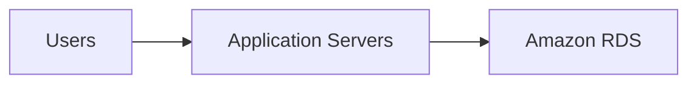

# Legend
- [[#Unmanaged vs Managed Services]]
- [[#Section 1 Relational Database Service]]
- [[#Section 2 DynamoDB]]
- [[#Section 3 Redshift]]
- [[#Section 4 Aurora]]
- [[#Section 5 Choosing Databases]]

# Unmanaged vs Managed Services

AWS Solutions has two types of categories
- Unmanaged
- Managed

Unmanaged:
- Scaling, fault tolerance and availability are managed by customer
- Typically provisioned in discrete portions that are specified by user
- Allows user to have control on how service responds to: load, errors and when it becomes unavailable

Managed:
- Scaling, fault tolerance and availability are typically built into the service
- Has pre-defined configurations, user can configure anytime

# Section 1 Relational Database Service

Go to legend: [[#Legend]]
Go to Sections:
- [[#Section 2 DynamoDB]]
- [[#Section 3 Redshift]]
- [[#Section 4 Aurora]]

Go to internal Sections: 
- [[#Challenges of Relational Databases]]
- [[#Amazon RDS]]
- [[#From on-premise to RDS]]
- [[#RDS DB Instances]]
- [[#RDS in VPC]]
- [[#RDS read replicas]]
- [[#Use cases of RDS]]
- [[#When to use RDS]]
- [[#Billing of RDS]]

## Challenges of Relational Databases
When running own relational database on premise, many administrative tasks needed
- Server maintenance and energy footprint
- Software installation and patches
- Database backups and high availability
- Limits on scalability
- Data security
- OS installation and patches

## Amazon RDS
A managed service that sets up and operates a relational database in the cloud

Quick high level overview:

It provides a service that address on-premise problems
- Set up, operate and scale RD without any administration
- Cost efficient and resizable capacity
- Automating time-consuming tasks
- Primary focus shifts to data and optimizing application

Access RDS via
- Management Console
- CLI
- API calls

## From on-premise to RDS

>[!note] Overview of the changes
>

RDS (and Aurora) is like a PaaS
- User manages and focuses on application only
- AWS manages all other aspects

## RDS DB Instances

>[!note] High level overview
>

A basic building block is a database instance (DB instance)
- Isolated DB environment 
- Can contain multiple user-created databases
- Accessed using same tools or application with standalone DB instance
- Resources in DB instance are determined by instance class
- Type of storage is determined by type of disks
- DB engine to run on instance (MySQL etc.)

## RDS in VPC
In VPC will run the same
- Usually in isolated private subnet made accessible to indicated application instances

>[!note] Basic topology
>

>[!note] High availability with Multi-AZ topology
>
>- Can configure to create a standby copy in another AZ, all stuff that happens are synced so it will keep updating
>- Increases availability and protect against failure 
>- If failure, the standby will become main instance
>- Applications will reference the database by using the same RDS DNS endpoint, user no need change code to let services access standby instance

## RDS read replicas

>[!note] High level overview
>

RDS supports creation of read replicas for:
- MySQL
- MariaDB
- PostgreSQl
- Amazon Aurora

How it works:
- Updates made on source database instance are asynchronously copied to read replica instance 

Benefits:
- Reduce load on main instance as application can READ from read replica 
- Can become primary database instance but needs manual action because of async replication
- Can be created in different region from primary database 

## Use cases of RDS

| Use | Reason |
| ---- | ---- |
| Web and mobile apps | High throughput, Massive storage scalability, and High availability  |
| Ecommerce Applications | Low-cost database, Data security, and fully managed solution |
| Mobile and online games | Rapidly grow capacity, automatic scaling, and database monitoring |
- No licensing constraints

## When to use RDS

Use when you application requires:
- Complex transaction or queries
- Medium to high query or write rate up to 30k IOPS (15k reads + 15k writes)
- No more than a single worker node or shard
- High durability

Do not use when application requires:
- Massive read/write rates (150k writes per second)
- Sharding due to high data size or throughput demands
- Simple GET or PUT requests and queries that NoSQL database can handle

Sharding
- Partitioning database into smaller, easier managed parts

For circumstances that we should not use RDS: 
- We can consider using NoSQL database solution, which has higher IOPS (DynamoDB) 
- OR running own relational database engine on AWS EC2 (provides more options to customize)

## Billing of RDS

Clock-hour billing:
- Resource incur charges when running
- Stops when terminated

Database characteristics:
- Physical capacity of database
	- Engine
	- Size
	- Memory class

DB purchase type:
- On-Demand Instance
	- Compute capacity by the hour
- Reserved Instance
	- One time upfront payment for instances reserved for 1 to 3 years

Number of DB instances:
- Provision multiple DB instances to handle peak loads

Provisioned storage:
- No charge
	- Back up storage of up to 100% for an active database
- Charge (GB/Month)
	- Backup storage for terminated DB instances

Additional storage:
- Charge (GB/month)
	- Backup storage in addition to provisioned storage

Requests:
- The number of input and output requests that are made to the database

Deployment type
- Single AZ
- Multiple AZ

Data transfer
- No changer for inbound
- Tiered charges for outbound data transfer

# Section 2 DynamoDB

Go to legend: [[#Legend]]
Go to Sections:
- [[#Section 1 Relational Database Service]]
- [[#Section 3 Redshift]]
- [[#Section 4 Aurora]]

Go to Internal Sections:
- [[#Relationship vs Non-relational]]
- [[#What is DynamoDB]]
- [[#Dynamo DB Core Components]]
- [[#Partitioning in DynamoDB]]
- [[#Taking full advantage of DynamoDB]]

## Relationship vs Non-relational

>[!note] Table explaining differences
>

**Relational Database:** 
- Relational database (RDB) works with structured data organized by tables and columns 
- RDB have relationships between database tables 
- RDB have difficulties when scaling out horizontally or working with semi-structured data and requires many joints for normalized data

**Non-Relational database:** 
- Work well with unstructured and semi-structured data

## What is DynamoDB
A fast and flexible NoSQL database service
- Consistent single-digit-millisecond latency at any scale
- A PaaS

Features of Dynamo DB
- Data is encrypted by default
- Supports document and key : value store models
- Auto partitions data in table
- No practical limit on number of items stored in a table
- No limit on throughput
- Storage automatically grows
- NoSQL database allows item in same table to have different attributes
- Data stored in SSDs
- Simple query language
- Manually scaled read/write throughput (Can able auto scaling)
- Include global tables which enables user to auto replicate across Regions, encryption at rest and item Time-To-Live

## Dynamo DB Core Components

These are tables, items, and attributes
- A table is a collection of data
- Items are a group of attributes uniquely identifiable among all other items
- Attributes are a fundamental data element

DynamoDB supports two different kinds of primary keys
- Partition key -> A simple primary key, made out of one attribute called the sort key (Items in data are identified with their unique record)
- Composite primary key -> Partition key and sort key, composed of two attributes (Used to sort partitioned data)

>[!note] Primary key
>

## Partitioning in DynamoDB

>[!note] Image on partitioning
>

Table data is partitioned and indexed by primary key

2 different ways to retrieve data:

Query operation
- Takes advantage of partitioning to locate items using primary key ONLY

Scan operation
- Locate items by matching conditions on non-key attributes
- Flexibility to locate items by other attributes
- Less efficient as DB will need to scan through all items in table

## Taking full advantage of DynamoDB

Important to think about the key that you use to identify items

>[!note] Single vs Compound keys
>
>>[!question] Quick explanation on keys
>>- A single key means the data is identified by an item in the data that uniquely identifies each record. 
>>- A compound key is made up of a partition key and a second key that can be used for sorting data.

We are able to setup a simple primary key based on 1 attribute of data values with uniform distribution
- Distribution such as Globally Unique Identifier (GUID) etc.

>[!example]- Some use cases
> If you wanted to model a table with products, you could use some attributeslike the product ID. Alternatively, you can specify a compound key, which is composed of a partition key and a secondary key. In this example, if you had a table with books, youmight use the combination of author and title to uniquely identify table items. This method could be useful if you expect to frequently look at books by authorbecause you couldthen use query.

# Section 3 Redshift

Go to legend: [[#Legend]]
Go to Sections:
- [[#Section 1 Relational Database Service]]
- [[#Section 2 DynamoDB]]
- [[#Section 4 Aurora]]

Go to Internal Section:
- [[#What is Redshift]]
- [[#Introduction to Redshift]]
- [[#Parallel Processing Architecture]]
- [[#Redshift costs]]
- [[#Automation and scaling]]
- [[#Redshift supported tools]]
- [[#Use cases of RedShift (Understand)]]

## What is Redshift
It is a fully managed data warehouse 
- Simple and cos-effective way to analyze your data
- Uses standard SQL 
- Uses your existing business intelligence (BI) tools

>[!question] What is a data warehouse
>- Data warehouses are used for analysis and reporting of data from multiple sources

## Introduction to Redshift

>[!note] High Level Overview
>

Reason for moving to Redshift
- building a data warehouse is complex and expensive
- Can take months and significant financial resources to set up

Benefits of Redshift
- Fast and powerful
- Easy to setup, use and scale
- Can run complex analytic queries against petabytes of data
- Query optimization, parallel data processing, columnar storage on high performing disks
- Encryption is optional

Redshift additional features:
- **Redshift Spectrum**
	- Feature allows us to run queries against **exabytes of data in S3**

## Parallel Processing Architecture

>[!note] High level Overview of Parallel Processing Architecture
>

Leader Node:
- Manages communications with client programs and all communications with compute nodes
- Parses and develops plans to carry out database operations for complex queries
- It splits up and assigns the plan in a code to the compute nodes (Parallel)
- Compute nodes run their assigned code and sends intermediate results to leader (Processing)

## Redshift costs
- Pay for what you use
- Starts as little as 25cents/H
- At scale, can deliver storage and processing for approximately $1k/tb/year (3 year PURI)

## Automation and scaling

>[!note] High level overview
>

From redshift cluster
- Easily do administrative tasks
- Allows you to focus on data and business

Scalability:
- Cluster can be easily scaled up and down as your needs change 

Availability:
- Redshift automatically monitors clusters and backups data

Security:
- Security built in
- Strong encryption of data both at rest and in transit
- Need to be enabled by user

## Redshift supported tools
- Compatible with standard SQL
- Has high-performance Java Database Connectivity (JDBC) and Open Database Connectivity (ODBC)
- hese enable us to use SQL clients and BI tools of choice

## Use cases of RedShift (Understand)
Enterprise data warehouse
- Migrate at a pace the customers are comfortable with 
- Experiment without large upfront cost or commitment
- Respond faster to business needs

Big data
- Low price point
- Managed service for ease of deployment and maintenance
- Focus more on data and less on database management

SaaS 
- Scale the data warehouse capacity as demand grows
- Add analytic functionality to applications
- Reduce hardware and software costs

# Section 4 Aurora

Go to legend: [[#Legend]]
Go to Sections:
- [[#Section 1 Relational Database Service]]
- [[#Section 2 DynamoDB]]
- [[#Section 3 Redshift]]

Go to Internal Section:
- [[#What is Aurora]]
- [[#Benefits of Aurora]]
- [[#Aurora has high availability]]
- [[#Resilient Design of Aurora]]

## What is Aurora
A MySQL and PostgreSQL compatible enterprise relational database for the cloud
- Performance and availability of commercial databases
- Simplicity and cost-effectiveness of opensource databases
- A fully managed database engine by RDS
- Automate time-consuming tasks

## Benefits of Aurora

>[!note] Quick Overview of Benefits
>

Benefits:
- Fast distributed storage subsystem
- Easy to setup and uses SQL queries
- Drop in compatibility with MySQL and PostgreSQL
- Pay as you go service 
- Integrated with AWS DB Migration Service and Scheme Conversion Tool (helps move datasets to Aurora)

## Aurora has high availability

>[!note] Overview of availability
>

Aurora has high availability and resilient design
- Stores multiple copies of data across multiple AZs 
- Continuous backups to S3 
- Use up to 15 read replicas 
- Instant crash recovery if primary database becomes unhealthy

## Resilient Design of Aurora
After database crash:
- Aurora does not need to replay and redo log from last checkpoint
- It does this on every read operation
- Buffer cache is moved out of Aurora DB process it becomes immediately available at restart
	- Reduces need to throttle access until cache is repopulated to avoid brownouts

# Section 5 Choosing Databases

Go to legend: [[#Legend]]
Go to Sections:
- [[#Section 1 Relational Database Service]]
- [[#Section 2 DynamoDB]]
- [[#Section 3 Redshift]]
- [[#Section 4 Aurora]]

Internal Sections:
- [[#Right tool for the right job]]

## Right tool for the right job

| Requirements | Database |
| ---- | ---- |
| Enterprise-class relational db | RDS |
| Fast and flexible NoSQL database service for anyscale | DynamoDB |
| Operating system access or application features that are not supported by AWS database services | Databases on Amazon EC2 |
| Specific case-driven requirement (machine learning, data warehouse, and graphs) | AWS purpose-built database service |